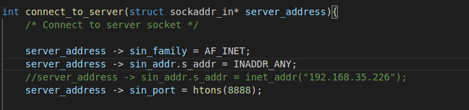

# Maze Runner
### Simrun Mutha and Kelly Yen

## Goals
Our MVP for this project is to build a simple, two player maze runner game that runs on a local network using a C implementation of a multi client server. Both players can connect to the game via their terminals, and race to complete the maze before the other player finishes. Once one player finishes the maze, the game ends and the time is displayed to both players.

If we’re able to complete the aforementioned MVP, a few stretch goals might include implementing a more advanced GUI or generating random mazes. We could also implement more advanced game features, such as a progress bar showing how close an opponent is to winning, or allowing for more than two players to play at a time.

## Learning Goals
**Simrun**: I want to learn about how to share data over local networks by using sockets and networks. I also want to get better at organizing code in various files to improve structure and readability. Additionally, I want to get more comfortable with some of the basic C concepts we learned earlier in the semester related to pointers and memory.

**Kelly**: I’d like to learn more about network programming and protocols, as those are areas I have little experience in. I’d also like to use this project to get better at working on collaborative software projects and develop better coding habits.

## Resources

Here are some of the resources that we used:

Ncurses documentation: https://tldp.org/HOWTO/NCURSES-Programming-HOWTO/
Multi client socket programming: https://www.geeksforgeeks.org/socket-programming-in-cc-handling-multiple-clients-on-server-without-multi-threading/
Socket programming: https://www.geeksforgeeks.org/socket-programming-cc/ 
Multithreading socket programming: https://www.geeksforgeeks.org/handling-multiple-clients-on-server-with-multithreading-using-socket-programming-in-c-cpp/ 

## Playing the game 

### Client 
To run the client code, simply compile everything by typing “make”, and run ‘./client. If a client is able to connect to a running server, it will print “connection established” and prompt you for a username.


Once a user enters their username, it will be printed back and the server will prompt the user to type “ready” in order to start the game.


Once all the connected clients type ready, the game begins for all clients and a maze is displayed on the terminal as shown below. The '@' sprite represents the player's position. Once in the maze, the clients try to get their sprite to the finish line using WASD keys. 


If the terminal window is too small, the program will prompt the user to resize their window until it's large enough to fully render the maze. 


Once a client finishes a game, the maze will disappear and the time taken by that user will be sent to the server. Once all the players have finished, the times taken by all the clients will be printed on each of the clients’ terminals, and both the client and server proccesses will automatically exit. 


If the client wishes to connect to the server through a specific ip address, they're able to do so by setting the address to inet_addr('xxx.xxx.xxx.xx), rather than INADDR_ANY, as indicated in the image below. 



### Server 
To run the server code, simply compile everything by typing “make”, and run ‘./server’. The terminal should tell you what port the server is listening to, and that it’s “Waiting for connections”. Once a client connects to the server, either through a local network with an ip address, or through the same machine’s local host, the server will print out the client’s ip address and port. If the new client connects successfully, the server code will also print out “Welcome message sent successfully” and “Adding to list of sockets as x”, where x is the number identifying that specific client’s socket. 

The server will continue to print out updates indicating what has been communicated by client sockets, including when the client enters a username or sends a ready signal. When all connected clients indicate that they are ready, the server will automatically start the game, and wait for clients to send their times. Once all clients have submitted a time, indicating that they all finished the maze, the server will send out the resulting scoreboard to all clients, and shut itself down. 


## What We Did

We were able to achieve our MVP and additionally allow more than 2 players to join the server and play the game. Once you finish the maze, the server sends a scoreboard that displays every user’s time so you can see who went through the fastest.

### Server 

To set up the server, the server code first creates and binds the master socket to the port specified at the top of server.c. This listener socket is set to allow for multiple connections, but won’t exceed 3 pending connections. 
 ```
 void create_master_socket(int *master_socket, struct sockaddr_in* address){
   /* Create and bind the master socket*/
 
   int opt = TRUE;
 
   //create a master socket
   if( (*master_socket = socket(AF_INET , SOCK_STREAM , 0)) == 0){
       perror("socket failed");
       exit(EXIT_FAILURE);
   }
  
   //set master socket to allow multiple connections
   if( setsockopt(*master_socket, SOL_SOCKET, SO_REUSEADDR, (char *)&opt, sizeof(opt)) < 0 ){
       perror("setsockopt");
       exit(EXIT_FAILURE);
   }
  
   //type of socket created
   address -> sin_family = AF_INET;
   address -> sin_addr.s_addr = INADDR_ANY;
   address -> sin_port = htons( PORT );
      
   //bind the socket to localhost port 8888
   if (bind(*master_socket, (struct sockaddr *)address, sizeof(*address))<0){
       printf("socket bind failed...\n%s\n", strerror(errno));
       exit(EXIT_FAILURE);
   }
   printf("Listener on port %d \n", PORT);
      
   //try to specify maximum of 3 pending connections for the master socket
   if (listen(*master_socket, 3) < 0){
       printf("Max number of pending connections reached, please try again later");
       exit(EXIT_FAILURE);
   }
 
}

 ```

 Once the master socket is ready to accept connections, the main function enters a while loop that continuously listens for incoming connection requests on the master socket, and IO operations on any of the already connected client sockets. For the sake of simplicity, this server doesn’t create multiple threads to handle each client, instead using the “select()” linux command to monitor multiple file descriptors, waiting until one of them becomes active. 

If the server detects an IO operation on one of the client sockets, it runs through a series of if/else statements to determine what message was sent. For instance, if the client sent “username”, the server can expect to read that client’s username on the next message. If the client sends “ready”, the server increments the num_playing variable, and checks to see if the number of client connections match the number of players that are ready. If those two values are equivalent, the server will start the game by sending “start” to every connected client.

If the incoming client message is the player’s time, it will concatenate the player’s username and time to the end message. Once the server has received times from every player, it will send the end message containing final scores to every client, exit the while loop, and close the master socket. 

 
 ```
 //Check if it was for closing
if (valread == 0){
    //Somebody disconnected , get their details and print

    getpeername(sd , (struct sockaddr*)&address , (socklen_t*)&addrlen);
    printf("Host disconnected , ip %s , port %d \n" ,
    inet_ntoa(address.sin_addr) , ntohs(address.sin_port));
    
    //Close the socket and mark as 0 in list for reuse
    close( sd );
    num_connected -= 1; 
    client_socket[i] = 0;
    if(needs_freeing[i])
        free(socket_usernames[i]);

} else if(accepting_username){
    //if previous message indicated next message is username, add current message as username 

    socket_usernames[i] = malloc(strlen(buffer) + 21);
    needs_freeing[i] = 1; 
    strcpy(socket_usernames[i],buffer); 
    printf("username set to %s\n", socket_usernames[i]);
    accepting_username = 0; 
} else if (strstr(buffer, "username")) {
    //indicate that next message contains username 

    accepting_username = 1; 
} else if (strstr(buffer, "ready")) {
    //player i is ready to start 
    
    num_playing += 1; 
    printf("%s is ready\n", socket_usernames[i]);
    if(num_playing == num_connected){
        printf("starting game\n");
        send_message(client_socket, start_message);
    }; 
} else if (strstr(buffer, "time:")) {
    //handle incoming time from client i 
    
    char new_score[200]; 
    printf("time recieved from %s\n", socket_usernames[i]); 
    sprintf(new_score, "%s%s seconds\n", socket_usernames[i], buffer); 
    strcat(end_message, new_score);
    num_finished += 1; 

    if(num_finished == num_playing){
        //if all players sent in time, end game
        free_memory(socket_usernames, needs_freeing); 
        send_message(client_socket, end_message);
        playing = 0;  
    }
}
 ```

### Client 

To set up the client, we use pthread_create() to start a new thread in the calling process. This function starts execution by invoking clientthread(), which contains everything the client needs to connect to the server and run the maze game. 

In clientthread(), we first create a stream socket, initialize its port and address, and connect it to the server socket. By default, the client looks for the server using any of its local ip addresses, however you’re also able to specify a specific ip address you want the client to look at. Once successfully connected to the server socket, the client code prompts the user for a username, and sends the user’s input to the server. Next, the client prompts the user to input ‘ready’ when all players are ready to start the game. Once the user inputs ‘ready’, the client will wait for a start message from the server. When the server sends the start message, the client code will run the maze.  

```
void* clienthread(void* args)
{
	// Create a stream socket
	network_socket = socket(AF_INET, SOCK_STREAM, 0);

	// Initialise port number and address
	struct sockaddr_in server_address;

	if(connect_to_server(&server_address) == 0){
		return 0; 
	};

	get_username();
	wait_for_user_ready(); 
	wait_for_server_ready(1); // wait for server to indicate all users are ready
	run_game(); // start game
	wait_for_server_ready(2); // wait for server to indicate all users finished maze, ending the game

	close(network_socket); // Close the connection
	pthread_exit(NULL);

	return 0;
}

```

### Maze generation and game

The maze itself was drawn manually by using an array of 1’s and 0’s to indicate where the edges borders of the maze should be. We had originally thought we would create randomly generated mazes, but realized that would present several problems as both players would not be able to receive the same maze unless we randomly generated it on the server and wrote it to the clients. We thought that sending an entire maze over the network connection would be a lot more complicated and present several problems, so we decided to just hardcode the maze layout so that each client can just access it locally. This way, the only information we had to transfer over the network are usernames and the time taken to complete the maze. We used the ncurses library to draw the maze as shown below:

```
void draw_maze(){
	/* Draws the maze and finish line*/	
	for(int i = 0; i < 30; i++){
		for(int j = 0; j < 39; j++){
			if (maze_array[i][j] == 0){
				mvaddstr(i, j*2 , "##");
			}
		}
	}
	mvaddstr(0, 30, "Finish");
	mvaddstr(1, 32, "/");
	mvaddstr(1, 33, "\\");
	move(0, 0);
}
```
To control the movement, we had functions that checked for keypresses to update the sprite accordingly, checked for the edges of the maze and checked if the sprite had crossed the finish line. Below is a code snippet that shows the main loop of the maze where all these functions work together. 

```
while (end_flag) {
    // Draw the maze
    if (check_screen_size())
        draw_maze();

    // Receive key press
    key = getch();	

    // Delete and store current position
    cputsxy(x,y," ");
    current_x = x;
    current_y = y;

    // Update sprite position
    update_sprite(&x, &y, key);
    // Check for edges
    check_edges(&x, &y, current_x, current_y);
    
    // check win
    if (check_win(&x, &y)){
        cputsxy(x,y,"@");
        stop = time(NULL);
        int final_time = stop - start;
        end_setup();
        return final_time;				
    }
    cputsxy(x,y,"@");

    // check for quitting
    if(key == 'q')
        end_flag = 0;	
}
```
Once players cross through the finish line, the time that it took each player to complete the maze is sent to the server. The times for all the players are then written back to the client in order for them to see how they ranked. 

## Reflection

**Simrun:** I thought our project was well-scoped and so we were able to achieve our MVP and also one of our stretch goals which was to allow multiple clients to connect to the server. I was able to achieve some of my learning goals especially in regards to organizing code and getting more familiar with pointers. I did not end up spending as much time working with sockets as I had originally thought, but I did end up learning about using ncurses which was interesting. 

**Kelly:** Our project was well scoped and was successful in allowing us to explore socket programming in more depth. I feel much more confident in C programming and working with network communication protocols. I was able to achieve most of my learning goals, although I wish I had more time to examine and improve the program’s security. Further improvements to the program’s robustness and security are necessary for it to be used by other people. 

