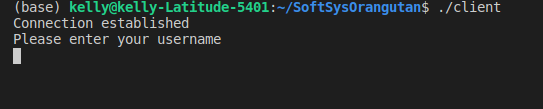
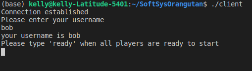
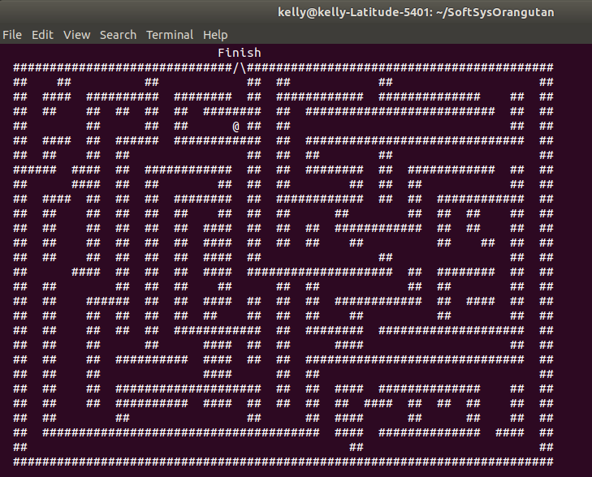
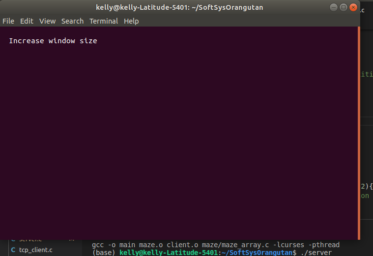
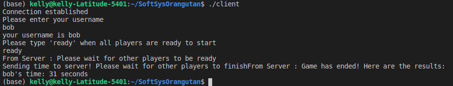
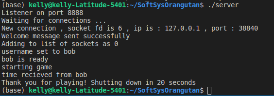

# Maze Runner
### Simrun Mutha and Kelly Yen

## Goals
Our MVP for this project is to build a simple, two player maze runner game that runs on a local network using a C implementation of a multi client server. Both players can connect to the game via their terminals, and race to complete the maze before the other player finishes. Once one player finishes the maze, the game ends and the time is displayed to both players.

If we’re able to complete the aforementioned MVP, a few stretch goals might include implementing a more advanced GUI or generating random mazes. We could also implement more advanced game features, such as a progress bar showing how close an opponent is to winning, or allowing for more than two players to play at a time.

## Learning Goals
**Simrun**: I want to learn about how to share data over local networks by using sockets and networks. I also want to get better at organizing code in various files to improve structure and readability. Additionally, I want to get more comfortable with some of the basic C concepts we learned earlier in the semester related to pointers and memory.

**Kelly**: I’d like to learn more about network programming and protocols, as those are areas I have little experience in. I’d also like to use this project to get better at working on collaborative software projects and develop better coding habits.

## Resources

Here are some of the resources that we used:

Ncurses documentation: https://tldp.org/HOWTO/NCURSES-Programming-HOWTO/
Multi client socket programming: https://www.geeksforgeeks.org/socket-programming-in-cc-handling-multiple-clients-on-server-without-multi-threading/
Socket programming: https://www.geeksforgeeks.org/socket-programming-cc/ 
Multithreading socket programming: https://www.geeksforgeeks.org/handling-multiple-clients-on-server-with-multithreading-using-socket-programming-in-c-cpp/ 

## Playing the game 

### Client 
To run the client code, simply compile everything by typing “make”, and run ‘./client. If a client is able to connect to a running server, it will print “connection established” and prompt you for a username.




Once a user enters their username, it will be printed back and the server will prompt the user to type “ready” in order to start the game.



Once all the connected clients type ready, the game begins for all clients and a maze is displayed on the terminal as shown below.  If the terminal size is too small for the maze to be printed, a message will be displayed prompting the user to increase their terminal size. Once in the maze, the clients try to get their player to the finish line using WASD keys. 





Once a client finishes a game, the maze will disappear and the time taken by that user will be sent to the server. Once all the players have finished, the times taken by all the clients will be printed on each of the clients’ terminals. 



### Server 
To run the server code, simply compile everything by typing “make”, and run ‘./server’. The terminal should tell you what port the server is listening to, and that it’s “Waiting for connections”. Once a client connects to the server, either through a local network with an ip address, or through the same machine’s local host, the server will print out the client’s ip address and port. If the new client connects successfully, the server code will also print out “Welcome message sent successfully” and “Adding to list of sockets as x”, where x is the number identifying that specific client’s socket. 

The server will continue to print out updates indicating what has been communicated by client sockets, including when the client enters a username or sends a ready signal. When all connected clients indicate that they are ready, the server will automatically start the game, and wait for clients to send their times. Once all clients have submitted a time, indicating that they all finished the maze, the server will send out the resulting scoreboard to all clients, and shut itself down. 



## What We Did

We were able to achieve our MVP and additionally allow more than 2 players to join the server and play the game. Once you finish the maze, the server sends a scoreboard that displays every user’s time so you can see who went through the fastest.

### Server 

### Maze generation and game

The maze itself was drawn manually by using an array of 1’s and 0’s to indicate where the edges borders of the maze should be. We had originally thought we would create randomly generated mazes, but realized that would present several problems as both players would not be able to receive the same maze unless we randomly generated it on the server and wrote it to the clients. We thought that sending an entire maze over the network connection would be a lot more complicated and present several problems, so we decided to just hardcode the maze layout so that each client can just access it locally. This way, the only information we had to transfer over the network are usernames and the time taken to complete the maze. We used the ncurses library to draw the maze as shown below:

```
void draw_maze(){
	/* Draws the maze and finish line*/	
	for(int i = 0; i < 30; i++){
		for(int j = 0; j < 39; j++){
			if (maze_array[i][j] == 0){
				mvaddstr(i, j*2 , "##");
			}
		}
	}
	mvaddstr(0, 30, "Finish");
	mvaddstr(1, 32, "/");
	mvaddstr(1, 33, "\\");
	move(0, 0);
}
```
To control the movement, we had functions that checked for keypresses to update the sprite accordingly, checked for the edges of the maze and checked if the sprite had crossed the finish line. Below is a code snippet that shows the main loop of the maze where all these functions work together. 

```
	while (end_flag) {
		// Draw the maze
		if (check_screen_size())
			draw_maze();

		// Receive key press
		key = getch();	

		// Delete and store current position
		cputsxy(x,y," ");
		current_x = x;
		current_y = y;

		// Update sprite position
		update_sprite(&x, &y, key);
		// Check for edges
		check_edges(&x, &y, current_x, current_y);
		
		// check win
		if (check_win(&x, &y)){
			cputsxy(x,y,"@");
			stop = time(NULL);
			int final_time = stop - start;
			end_setup();
			return final_time;				
		}
		cputsxy(x,y,"@");

		// check for quitting
		if(key == 'q')
			end_flag = 0;	
    }
```
Once players cross through the finish line, the time that it took each player to complete the maze is sent to the server. The times for all the players are then written back to the client in order for them to see how they ranked. 

## Reflection

**Simrun:** I thought our project was well-scoped and so we were able to achieve our MVP and also one of our stretch goals which was to allow multiple clients to connect to the server. I was able to achieve some of my learning goals especially in regards to organizing code and getting more familiar with pointers. I did not end up spending as much time working with sockets as I had originally thought, but I did end up learning about using ncurses which was interesting. 

**Kelly:**
